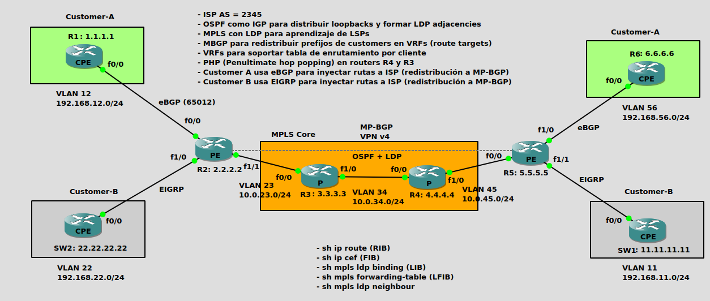
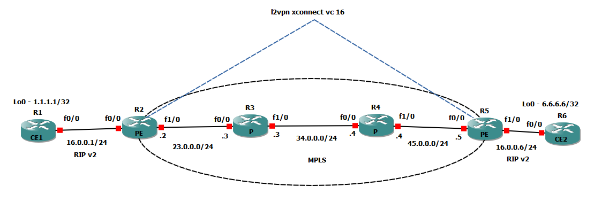
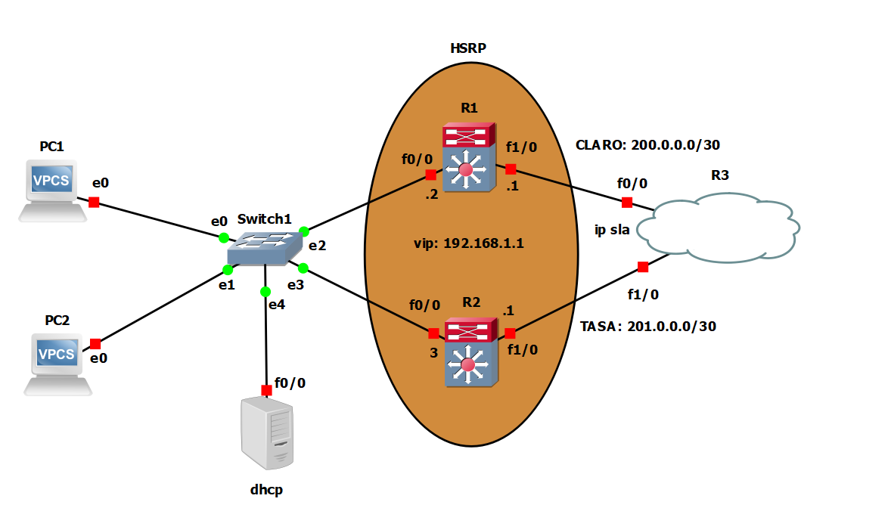

# Repositorio de laboratorios de red

**Content**
- [l3vpn](#l3vpn)
- [l2vpn](#l2vpn)
- [HSRP](#hsrp)

### l3vpn




- Se define un core MPLS con múltiples caminos en la topología física con el objetivo de probar configuraciones de TE con LDP, RSVP tanto para intServ como diffServ

- Por defecto, el core MPLS estará configurado con LDP para dar servicios de l3vpn. Se utilizará OSPF como IGP dentro de la red de transporte

- LDP utilizará las rutas seleccionadas por el IGP (en este caso con algoritmo SPF) para seleccionar el mejor LSP dentro de la LFIB (Lable Forwarding Information Base). Ver ejemplo práctico en R3, donde se selecciona R4 como próximo salto para alcanzar la lo0 de R5 (5.5.5.5/32)

- Se configuran VRFs por cliente en los PE 

- CUSTOMER-A distribuira sus rutas a través de eBGP y CUSTOMER-B con EIGRP

- Las rutas de los sitios son redistribuidas con comunidades BGP utilizando Route Distinguishers y Router Targets (Multi protocol BGP VPN v4)

- TE podrá configurarse con RSVP o BGP

LIB router 3:
```
  lib entry: 5.5.5.5/32, rev 12
	local binding:  label: 301
	remote binding: lsr: 4.4.4.4:0, label: 401
	remote binding: lsr: 7.7.7.7:0, label: 600
	remote binding: lsr: 2.2.2.2:0, label: 201
```

Si bien alcanza el prefijo 5.5.5.5/32 por R4 y R7, en la FLIB se instala solamente el LSP que pasa por R4 ya que es la ruta mas corta seleccionada por OSPF.

```
R3#sh mpls forwarding-table 
Local      Outgoing   Prefix           Bytes Label   Outgoing   Next Hop    
Label      Label      or Tunnel Id     Switched      interface              
300        No Label   7.7.7.7/32       0             Fa1/1.36   10.0.36.2   
301        401        5.5.5.5/32       0             Fa1/0.34   10.0.34.4   
302        Pop Label  4.4.4.4/32       0             Fa1/0.34   10.0.34.4   
303        Pop Label  2.2.2.2/32       0             Fa0/0.23   10.0.23.2   
304        Pop Label  10.0.63.0/24     0             Fa1/0.34   10.0.34.4   
           Pop Label  10.0.63.0/24     0             Fa1/1.36   10.0.36.2   
305        Pop Label  10.0.45.0/24     0             Fa1/0.34   10.0.34.4  
```

Tabla de enrutamiento R3:

```
      5.0.0.0/32 is subnetted, 1 subnets
O        5.5.5.5 [110/3] via 10.0.34.4, 00:19:30, FastEthernet1/0.34

```

Configuracion de MP-BGP en R2#:

```
router bgp 2345
 bgp log-neighbor-changes
 no bgp default ipv4-unicast
 neighbor 5.5.5.5 remote-as 2345
 neighbor 5.5.5.5 update-source Loopback0
 neighbor 192.168.12.1 remote-as 65012
 !
 address-family ipv4
 exit-address-family
 !
 address-family vpnv4
  neighbor 5.5.5.5 activate
  neighbor 5.5.5.5 send-community both
 exit-address-family
 !
 address-family ipv4 vrf CUSTOMER-A
  redistribute connected
  neighbor 192.168.12.1 remote-as 65012
  neighbor 192.168.12.1 activate
  neighbor 192.168.12.1 send-community both
 exit-address-family
 !
 address-family ipv4 vrf CUSTOMER-B
  redistribute connected
  redistribute eigrp 1
 exit-address-family
ip bgp-community new-format

router eigrp 65535
 !
 address-family ipv4 vrf CUSTOMER-B autonomous-system 1
  default-metric 100000 10 255 1 1500
  redistribute bgp 2345
  network 192.168.22.0
 exit-address-family
  redistribute eigrp 1
```

Rutas aprendidas de todas las address-family en instancia BGP de R5#:

```
R5#sh ip bgp vpnv4 all 
BGP table version is 13, local router ID is 5.5.5.5
     Network          Next Hop            Metric LocPrf Weight Path
Route Distinguisher: 2345:1 (default for vrf CUSTOMER-A)
 *>i 1.1.1.0/24       2.2.2.2                  0    100      0 65012 ?
 *>  6.6.6.0/24       192.168.56.1             0             0 65056 ?
 *>i 192.168.12.0     2.2.2.2                  0    100      0 ?
 *>  192.168.56.0     0.0.0.0                  0         32768 ?
Route Distinguisher: 2345:2 (default for vrf CUSTOMER-B)
 *>  11.11.11.0/24    192.168.11.1        156160         32768 ?
 *>i 22.22.22.0/24    2.2.2.2             156160    100      0 ?
 *>  192.168.11.0     0.0.0.0                  0         32768 ?
 *>i 192.168.22.0     2.2.2.2                  0    100      0 ?
```
# l2vpn
Esquema de l2vpn sobre red mpls utilizando ospf para redistribucion de loopbacks. Por otro lado, se utiliza xconnect en extremos de clientes para generar un vinculo l2 a través de nube mpls y RIP para redistribución de rutas entre extremos.

```
interface FastEthernet0/0
 no ip address
 duplex full
 no keepalive
 xconnect 5.5.5.5 16 encapsulation mpls pw-class R1_L2-R6_L2
end
```




# hsrp

Se utiliza HSRP para dar redundancia a default gateway de una red con multiples proveedores. Además, se utiliza tracking para cambiar el costo de la prioridad HSRP ante caida de interfaz wan. Tambien se utiliza IP SLA para trackear el estado de las interfaces del lado carrier.

